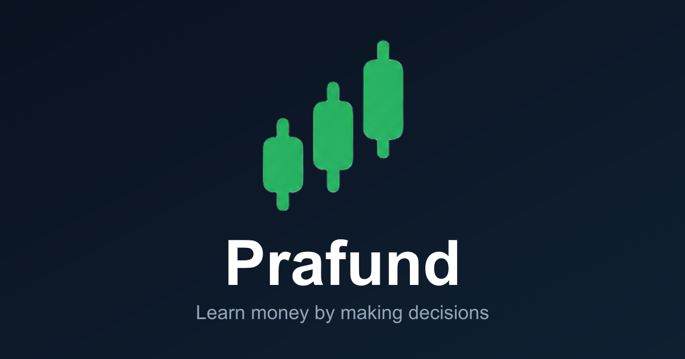

<div align="center">



# Prafund 🟢

**What would you do with your first paycheck?**

Prafund is a free financial life simulator for students — pick a career, get a fictional salary, build a budget, invest simulated money in a real-ticker market, and watch your decisions play out with zero real-money risk.

[**▶ Play it now**](https://pranaygollu2009-create.github.io/prafund/) · [How It Works](https://pranaygollu2009-create.github.io/prafund/how-it-works) · [Markets](https://pranaygollu2009-create.github.io/prafund/markets)


</div>

---

## 💡 Why Prafund

Most people learn money habits by *losing* money. Prafund gives students a safe sandbox instead:

- **Real stakes feel, zero real risk** — a full paycheck, rent, groceries, investing — none of it real
- **Judgment over luck** — the simulator rewards steady, boring, smart decisions the way real life does
- **No signup wall** — start playing in under a minute; create an account only if you want your progress saved to the cloud

## ✨ Features

| | |
|---|---|
| 🧭 **Career journeys** | Pick a job and salary, then live out months of financial decisions |
| 📊 **Live-style markets** | Real tickers (S&P 500, AAPL, NVDA, BTC…) with honest simulated pricing — no API key needed; wire in live quotes with one env var |
| 📈 **Portfolio & charts** | Buy, hold and track investments with real charts and benchmarks |
| 🧠 **Learn mode** | Built-in glossary and lessons that explain the terms you just used |
| ☁️ **Cloud saves** | Optional accounts keep progress in sync across devices |
| 📱 **Mobile-first** | Works great on a phone in class, on the bus, or between lectures |

## 🚀 Run it locally

```bash
git clone https://github.com/pranaygollu2009-create/prafund.git
cd prafund
npm install
npm run dev
```

The app runs on `http://localhost:8080` (or the port your setup picks).

**Static build** (what GitHub Pages serves):

```bash
npm run build:pages    # outputs dist/client — index.html, 404.html, .nojekyll
```

## ☁️ Tech stack

- [TanStack Start](https://tanstack.com/start) + React 19 + TypeScript
- Tailwind CSS 4 + shadcn/ui components
- Supabase (optional — auth + cloud saves)
- GitHub Actions → GitHub Pages CI/CD, zero-config deploys on every push to `main`

## 🗺️ Roadmap

- [x] Core simulator engine (career → paycheck → budget → invest)
- [x] Live market feed support (`VITE_MARKET_QUOTES_URL` → real quotes)
- [x] GitHub Pages auto-deploy
- [ ] Real live quotes on the public deployment
- [ ] Classrooms mode — teachers assign journeys to a class
- [ ] Leaderboards and streaks

## 📄 About

Built as an educational tool — **not** financial advice. All money is fictional. See the [in-app disclaimer](https://pranaygollu2009-create.github.io/prafund/help) for details.

---

<div align="center">

**⭐ Star this repo if you like the idea — it helps other students find Prafund!**

</div>
